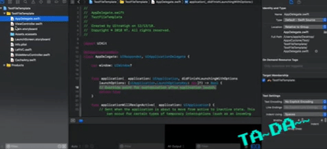

# HTFileTemplate
My own file template

## Installation

- Download it.
- Open Finder and go to this folder (press Command + shift + G): ~/Library/Developer/Xcode/Templates
- Paste 2 folder: Indicator & Custom in.

